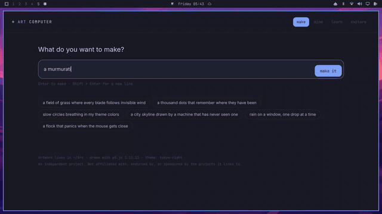
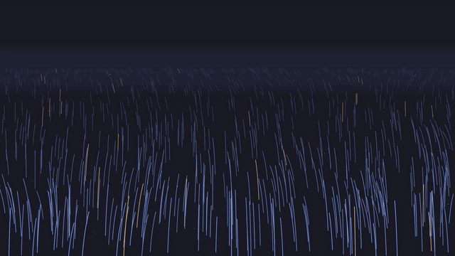

# Art Computer

**Make computational art by talking to your coding agent.**

Art Computer turns a prompt into a running p5.js sketch that lives as plain
source in `~/Art` — a directory you own, can read, can edit, and can learn from.

```bash
art make "a murmuration of starlings at dusk"
```



<sub>One unbroken take: the prompt goes in, the agent writes `sketch.js`, and the
canvas beside it comes alive as the file saves. Sped up through the thinking —
about two and a half minutes in real time.
[Full quality video](docs/process.mp4).</sub>

That scaffolds the piece, opens it in its own window, and hands it to whichever
coding agent you already use. You watch the canvas redraw as it writes.



<sub>*Wind Field* — 129 lines of plain JavaScript, picking up the desktop's Tokyo
Night colours. [Full quality video](docs/demo.mp4).</sub>

**The artwork is code, not an image.** A PNG is an export. The program is the
thing, and it is small enough to read.

## What you get

```
~/Art/
  lib/p5.min.js       p5.js 1.11.13, vendored once, works offline
  lib/palette.js      your Omarchy theme as colors, regenerated on theme change
  AGENTS.md           the house style your agent follows
  wind-field/
    index.html        loads p5 and sketch.js. Nothing else.
    sketch.js         the artwork. ~150 lines of plain JavaScript.
    art.json          title, seed, the prompt that started it, inspiration
    README.md         what it is, and who inspired it
```

No `package.json`. No bundler. No framework. No build step. If you can read
JavaScript you can read every line of your own artwork — which is the point.

## Install

Requires: `bash`, `jq`, and `node` (or `python3` for a no-live-reload fallback).
Built for [Omarchy](https://omarchy.org), degrades gracefully elsewhere.

```bash
git clone https://github.com/Raulonastool/art-computer.git
cd art-computer
./install.sh          # --menu also adds Omarchy menu entries
                      # --art-home <dir> puts the sketchbook somewhere else
```

It symlinks the CLI rather than copying it, so the checkout stays live — `git
pull` updates your install. Re-running it never overwrites p5, your `AGENTS.md`,
or a `bindings.lua` it has already wired. Two files *are* refreshed from the
repo on every run — `~/.config/hypr/art-computer.lua` and the desktop entry — so
if you edit those, keep a copy.

Then:

```bash
art make "a thousand dots that remember where they have been"
art home              # or SUPER + A
```

## Commands

```
art make "<prompt>"    scaffold it, show it, hand it to your agent
art home               the home page: make, your gallery, learn, explore
art list               everything you have made
art run [name]         show a piece in its own window
art open [name]        talk to your agent about a piece
art new [name]         an empty sketch, no agent
art path [name]        print its directory
art palette            refresh colors from your Omarchy theme
art serve [--stop|--status|--log]
art version            what you are running, and which p5
```

Every command takes the piece you are standing in, or the most recent one, when
you leave the name off.

## How it works

- **One local server** (`lib/art-serve.mjs`, ~340 lines, no dependencies) serves `~/Art` on
  `127.0.0.1:4242`. It is why a sketch can say `<script src="../lib/p5.min.js">`.
- **Live reload is injected into the response**, never written into your
  `index.html`. Your file on disk stays clean.
- **Your agent, not ours.** Art Computer ships no AI. It runs whichever agent
  Omarchy is configured to use.
- **The seed is the reproducibility.** `SEED` in `sketch.js` and `seed` in
  `art.json` stay in sync: same seed, same picture. Change the seed for a
  variation, change the code for a revision.
- **Your theme is the palette.** `art palette` renders the active Omarchy theme
  to `~/Art/lib/palette.json` and `palette.js`, and a theme-set hook keeps it
  current, so "use my colors" is always true.

## Why it works that way

The short version of every decision, with the trade-off each one accepts, is in
**[docs/DESIGN.md](docs/DESIGN.md)**. The ones worth knowing before you install:

- **The artwork is source, not an image**, and everything else follows from it.
- **No AI is bundled.** Art Computer drives the agent you already configured, so
  output quality is your agent's, and nothing works until you have set one.
- **p5.js 1.x, vendored offline.** 2.x broke `preload()` and async loading, so
  the tutorials a beginner will actually find do not run on it.
- **The filesystem is the data model.** No database, no index, no lock-in — a
  piece is a working static site that does not need Art Computer to run.
- **Omarchy-first.** The desktop integration is good because it targets one
  desktop. Elsewhere you get the CLI and the sketchbook, without the wiring.

## What it touches

Everything, and nothing else:

| Path | What |
| --- | --- |
| `~/.local/bin/art` | symlink to the CLI |
| `~/Art/` | your sketchbook (p5.js, palette, `AGENTS.md`, `CLAUDE.md`) |
| `~/.claude/skills/art-computer` (and `.agents`, `.codex`) | symlinked agent skill |
| `~/.config/hypr/art-computer.lua` | SUPER+A, SUPER+ALT+A, full-opacity canvas windows |
| `~/.config/hypr/bindings.lua` | one `require()` line, between markers, backed up first |
| `~/.config/omarchy/hooks/theme-set.d/10-art-palette` | symlink; regenerates the palette |
| `~/.local/share/applications/art-computer.desktop` | launcher entry |
| `~/.config/omarchy/extensions/omarchy-menu.jsonc` | only with `--menu`, backed up first |

Nothing under `/usr/share/omarchy` is written.

One more file is touched later, not at install time. Every piece is a brand-new
directory, and a coding agent meeting a directory for the first time stops to ask
whether it is trusted — so `art make` would end its first run on a modal dialog
that defaults to *no*. When your default agent is Claude Code, `art` records that
consent for you in `~/.claude.json`, for that one piece directory. It only ever
marks a directory that sits directly inside `~/Art` and carries an `art.json` —
that is, one `art` made itself, a second ago, because you asked it to. Nothing
else is trusted on your behalf, no other setting is changed, and `./uninstall.sh`
hands it all back.

```bash
ART_NO_TRUST=1 art make "..."   # keep the prompt
```

```bash
./uninstall.sh            # removes everything in the table above
./uninstall.sh --purge    # also removes ~/Art/lib and the agent instructions
```

**Your artwork is never touched by either script.** Uninstalling also hands back
the trust described above: it clears those three flags from every piece entry in
`~/.claude.json`, and only those three. The rest of each entry is Claude Code's
own record of sessions that really happened, so it stays — that file belongs to
Claude Code, not to Art Computer.

## Status

**This is an MVP.** The core loop works and is what the video shows. It is a
weekend-sized project, used by its author, published in case it is useful.

Working and reasonably solid:

- `art make` end to end — scaffold, window, agent, live reload.
- The local server, live reload, and the vendored offline p5.
- The palette pipeline, including regeneration on theme change.
- `install.sh` / `uninstall.sh`, both idempotent, neither touching your artwork.

Thin, and known to be:

- **One medium.** `--medium` is a real hook with exactly one implementation
  behind it (`template/p5`). Anything else is an error today.
- **Trust pre-approval is Claude Code only.** The other eight agents Omarchy
  supports fall through to a no-op and will still show their own first-run
  prompt.
- **Tested on one machine.** Omarchy, Hyprland, Arch, single monitor. Nothing
  about multi-monitor or another compositor has been exercised.
- **No test suite.** Correctness so far is "it ran on my laptop."
- **Slugs are naive.** `slug_from_prompt` takes the first three words that
  survive a small stopword list, so *"a murmuration of starlings at dusk"*
  becomes `murmuration-starlings-at`, dangling preposition and all.
- **Thumbnails are manual.** The gallery draws a placeholder from the seed
  unless you screenshot a piece into `thumbnail.png` yourself.

Not built, deliberately, for now: sharing or export, any account or sync, a
plugin system, sketch history beyond `git`.

## What's next

Candidates rather than commitments, roughly in the order they would pay off:

1. **A second medium** behind the existing `--medium` hook — GLSL shaders or
   Hydra — to prove the seam is real rather than theoretical.
2. **Trust pre-approval for the other agents**, once each config format has been
   verified rather than guessed at.
3. **Headless thumbnails.** The render rig that produced `docs/demo.mp4` already
   steps a sketch frame by frame in Chromium; pointing it at `thumbnail.png`
   would remove the one manual step in the loop.
4. **Better slugs**, and a `--name` escape hatch for when the generated one is
   wrong.
5. **A smoke test** that scaffolds, serves, and renders a piece in CI, so
   "it ran on my laptop" stops being the standard.

Issues and pull requests are welcome — see
[CONTRIBUTING.md](CONTRIBUTING.md).

## Credit

p5.js is made by the [Processing Foundation](https://processingfoundation.org)
and the p5.js community; Art Computer merely bundles it. The learning material
this points at belongs to [Daniel Shiffman / The Coding
Train](https://thecodingtrain.com), the Processing Foundation,
[OpenProcessing](https://openprocessing.org), [Shadertoy](https://shadertoy.com)
and [Olivia Jack / Hydra](https://hydra.ojack.xyz). See [NOTICE](NOTICE).

Independent project. Not affiliated with, endorsed by, or sponsored by any of
them, or by Omarchy.

## License

MIT — see [LICENSE](LICENSE). p5.js is LGPL-2.1 and is bundled unmodified.
